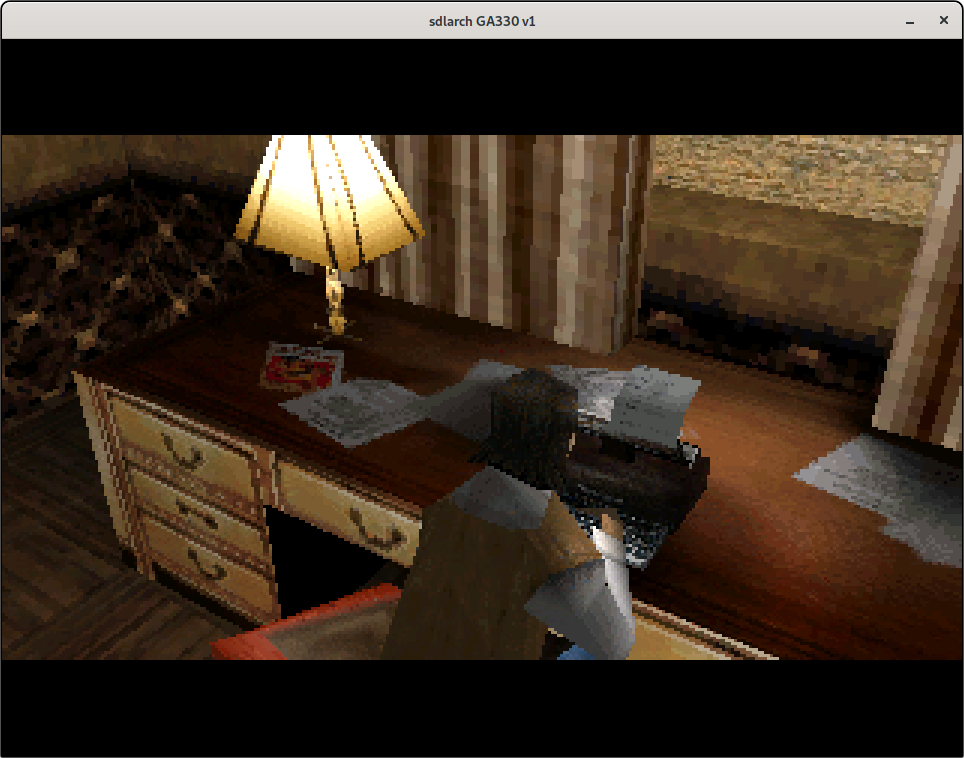
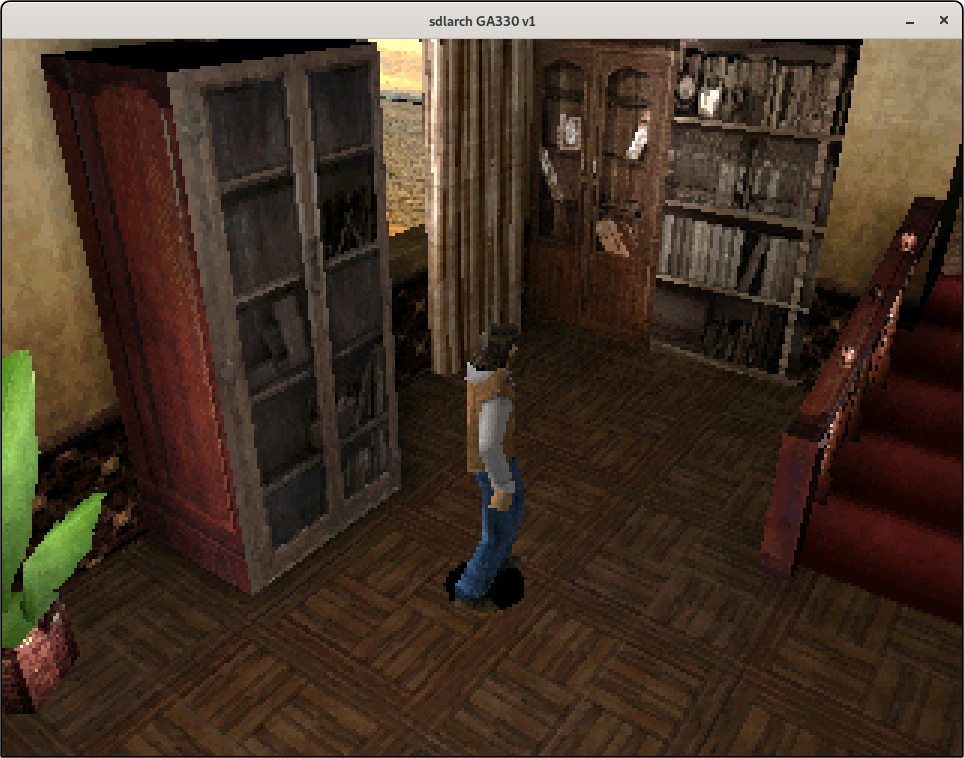

# GA330-libretro

## Status

7days boots into game !!!

 

## Contained herein

- GA330 libretro core
    - uses Unicorn to emulate CPU
- minimal replacement OS for ARM (handles loading of binaries etc.)
- some shared/portable functions (libCCOS)

## Compiling

First, you will need:

- C++ compiler for your host platform
- C compiler for embedded ARM (`arm-none-eabi-gcc`)
- working RetroArch or another libretro host

Then, to build everything:

- compile GA330 core via CMake. this step also generates thunks for miniSYS (bleh)
- compile minisys (`make -C minisys`)
- run/debug GA330 core via your libretro host

## Debugging ARM code

Currently unsolved. Unicorn is based on QEMU, but QEMU GDB stuff is probably not usable there. `printf` is your friend!

## Memory map

    0x0408_8000 .. 0x0408_8FFF      memory-mapped I/O space (JTAG); reads & writes are ignored
    0x1000_0000 .. 0x13FF_FFFF      RAM, incl. application (64 MiB)
    0x1FF0_0000 .. 0x1FFF_FFFF      ARM stack (1 MiB)
    0x2000_0000 .. 0x2004_0000      minisys (256 KiB)
    0x3000_0000 .. 0x33FF_FFFF      CCDL is loaded here (up to 64 MiB)
